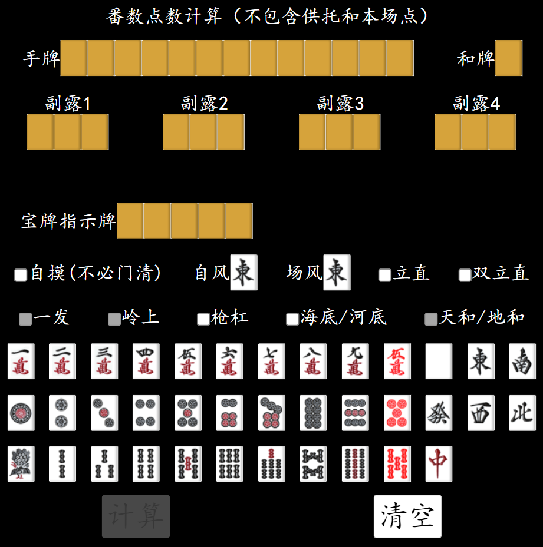
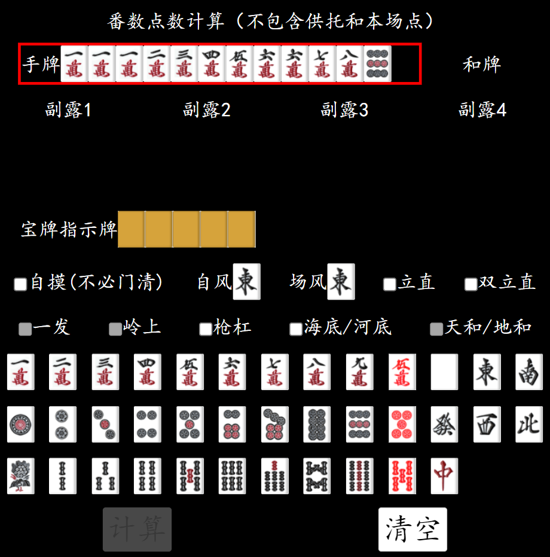
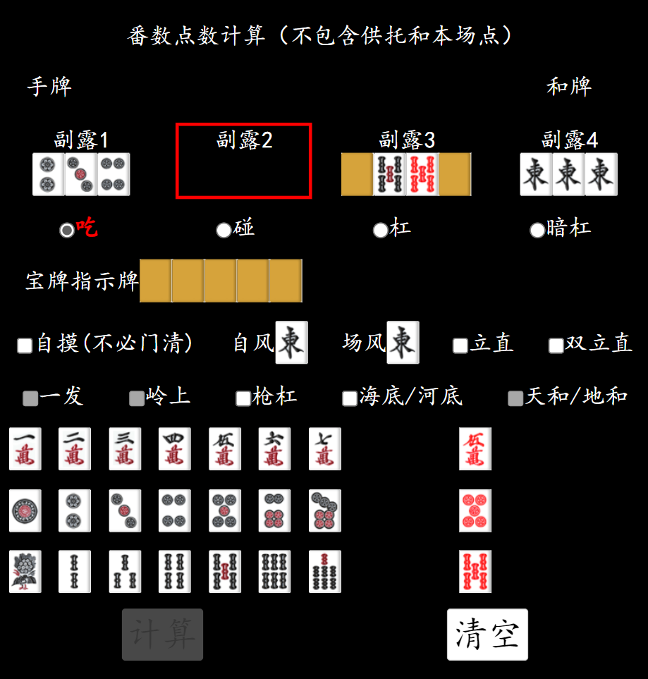
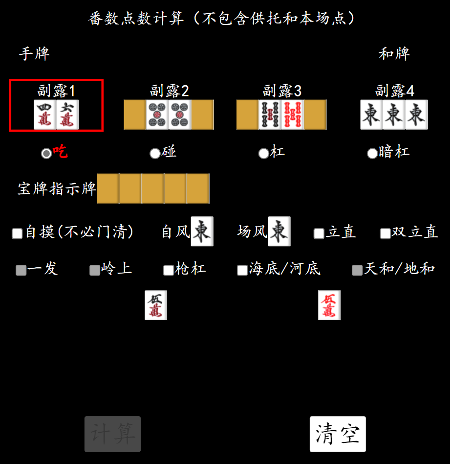
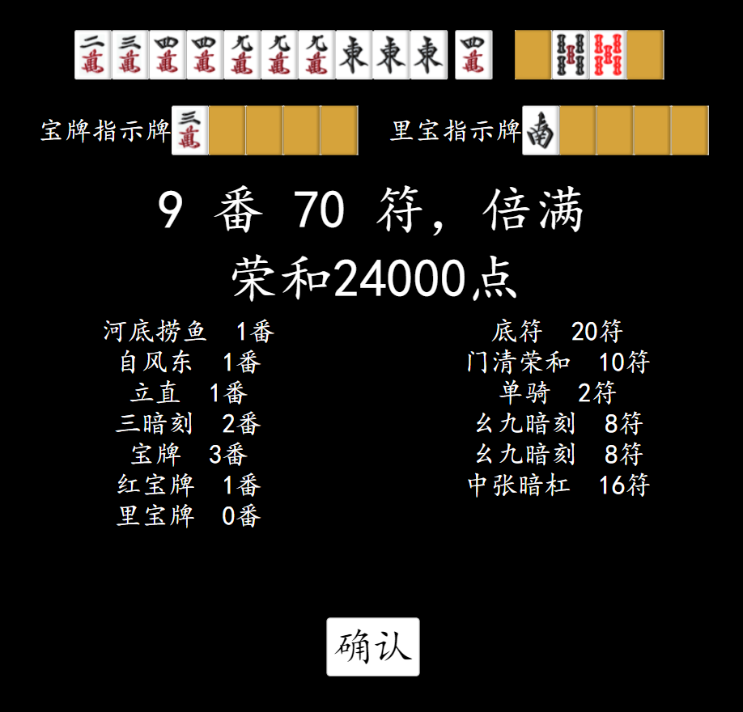

# MahjongCalculator

JS based riichi mahjong calculator

从之前的一些代码里挖了些出来拼了个简陋前端，用于计算日麻番数和符数。

目前只支持同花色红宝牌最多只有一张的情况，多张红宝牌暂不支持，可以根据计算结果自行添加。

三麻拔北不支持，其他役基本没差别应该可以通用。

## 基本界面

上图为初始界面。上半为手，中段为选项，下半为牌选择。

**不要忘了选自风和是否自摸**。

**不要忘了选自风和是否自摸**。

**不要忘了选自风和是否自摸**。

## 选手牌

首先点击手牌，框会变红，之后点击下面的牌就可以往里面填牌了。

如果点错了，点击不要的牌会删除。

## 选和牌

点和牌，选。

## 选副露

副露不要求从左往右，副露包含暗杠。点击任意一个要修改的副露，副露下面会弹出要添加的副露类型。

### 吃

添加吃类型的副露时，选择顺子的最小值（2345p选2p），会自动添加剩余张数。

特别的，当顺子包含5时：

- 对于567顺子，如果包含红宝牌直接点击红5，不包含直接点击普通5。
- 对于345和456，点击3或4，会自动填两张顺子并等待选择是红5还是普通5，选择即可。

### 碰、杠、暗杠

只要考虑包不包含红5，包含选红5，不包含选对应的即可。

### 删除

误选择副露时，首先选中要删除的副露，然后再点一次即可删除。

## 选宝牌指示牌

点击宝牌指示牌，然后选。注意是选指示牌，宝牌是指示牌后一张会自动计算。

选错了点击选错的宝牌会删除。

对于里宝牌，首先要勾上立直或者双立直才能选。

## 自摸、自风、场风

**不要忘了选自风和是否自摸**。这里自风和自摸并不是役，是用来判定和牌形和得点的
（四暗刻vs对对三暗刻，是不是庄家）。修改自风和场风也是先点击自风场风，然后选择东南西北。

## 其他特殊役

其他特殊役的对钩。有些不能选是因为有先决条件或者冲突（天和必须自摸，枪杠不能海底等），
请检查是否选择了冲突的项目或者未选先决条件。

## 计算页面

计算按钮会检查基本信息，例如是否存在某种牌超过4枚、手牌和副露数量是否正确等。基本信息正确可以点击计算。

计算页面会根据是否自摸是否庄家，给出手牌的番数符数点数（不包含供托和场棒），以及番符的详细列表。