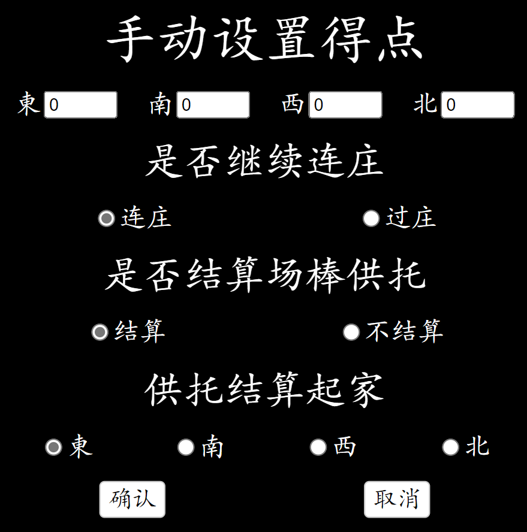

# MahjongHelper

A simple riichi mahjong helper page based on Vue.

虽然有很多日麻APP，但是想在Windows平板上用，随便找了找没找到，
用网页写了一个简易大字报版本，在Windows和Android上测试基本无问题，iOS待测试。

精简了很多东西，只保证基本使用体验，一些复杂的情况暂时不支持。

不提供指定和牌形算番功能，可以使用[MahjongCalc](../MahjongCalc/README.md)。

### 默认对局流程
- **设置**：进行参数设置，目前只能设置一些比较基本的内容。默认和雀魂对齐。
- 点击开始根据设置开始对局。没有随机座次和选起家，请自行决定后将平板手机底端对准东家。
- **立直**：需要立直时，直接点击面前的立直按钮，会立即拍下点棒并扣立直需要点数。如果宣言牌放铳
  请别按或者撤销立直，不然会收走立直棒。
- 一局的结束：
  - **有人自摸**：自摸的人点击面前的自摸/放铳按钮，并从面前的面板选择正确的番数和符数，
    点结算。部分番数通过多次点击得到（例如多次点击1番按钮会切换为234番）。
  - **有人荣和**：放铳的人点击面前的自摸/放铳按钮，和牌的人从面前的面板选择正确的番数和符数，
    如果多家和牌多家同时选择自己的番数符数，点结算。立直棒和场棒均为头跳，放铳家逆时针顺序
	  第一个和牌者全拿。
  - **流局**：四个人分别按面前的流局按钮切换听牌、未听、未选择状态。当所有人都选择了听牌状态时
    按中间出现的听牌结算按钮，会根据听牌情况结算罚符。
  - **未实现的特殊情况**：有些特殊的情况没有实现，这里给出一些替换操作。同时设置-手动设置得点中
	可以手动设置结算，包括每人得点失点，是否连庄，是否结算场棒供托等，替换操作不满足要求的时候
	可以使用该方式自行设置结算点数和规则。
	- **途中流局**：没实现，用四人听牌替换下就行了，等价。
	- **流局满贯**：没实现，对于单人流局满贯可以用自摸满贯代替，连庄，本场和收场棒等设定保持和自摸一致。
	- **诈和**：没实现，要么当成一炮三响（供托会清空），要么就别扣分了直接罚个摸切算了。
- **一场的结束**：不会判断终局条件，请自行判断（东风场、南风场、南入西入、飞人等）。
  如果终局，直接点击终局，此时场上所有多余点棒归一位所有，同分按照座次靠前排前面，
  结果页面将展示当前分数除1000加上顺位马点的精算得点。不考虑头名赏，如果有的话请自行
  在设置中修改马点和返点。
- **撤销**：在手滑的情况下可以撤销，开始、立直、和牌结算、流局结算和终局时会保存场面，撤销后
  会回到上一个保存的场面情况。有时可能会保存了奇怪的东西（听牌情况之类的）一般没大影响。
  **撤销后无法恢复，误撤销请重新操作。**
- **数据保存**：在浏览器不清空本地存储的情况下，会在localStorage保存历史场面和设置中内容。
  手机平板没电了一般只要开机重新进入网页就会自动恢复当前牌局。

### 功能介绍

#### 初始界面

- 开始：开始新的对局
- 设置：点开设置界面
- 骰子：投两个骰子
- 撤销：如果已有历史记录，进行撤销。可以撤销终局操作。
#### 对局界面

- 终局：立即根据当前得点进行结算。
- 中间从左到右分别为：场风、局数、右上供托棒数量，右下本场数。
- 骰子：投两个骰子，顺便会算从哪里开始摸牌。
- 每个玩家面前的信息：
  - 目前点数：目前的点数。点击自己的点数，可以显示和其他人的点差。
  - 自风：指示当前的自风。
  - 立直：按下后立即立直，扣除立直所需点数并显示立直棒。
  - 自摸/放铳：如果有人和牌，由自摸者或放铳者按下面前的自摸放铳按钮进行和牌结算。
  - 流局：当流局，四人分别按流局按钮，多次按可以切换流局听牌状态。四人均选择了流局听牌状态后，中间出现听牌结算按钮，点击即进行流局结算。
#### 和牌结算界面

- 绿色底色按钮表示已选择按钮。因为展示空间所限，部分番数符数（3番，倍满，100符等）通过点击
  按钮多次可以切换。例如多次按1番可以切换为1-4番。
- 多家和牌请多家选择自己面前的和牌番数符数。
- 选择完毕后点击中间的结算按钮，会自动计算和牌点数以及场供。
#### 设置界面

一般来说没必要修改设置，除非确定修改项目的意义。

- 初始点：对局开始时初始点。需要继承之前对局点数时可修改。
- 马点：最后根据顺位结算的马点。
- 流局听牌得点：流局听牌时，根据听牌人数，每个听牌的人得多少点。
- 流局没听失点：流局没听时，根据没听人数，每个没听的人失多少点。注意没有做听牌得失总和为0的判断，硬要凭空变点或者失点也是可以的。
- 返点：结算时的基准线，超出点数得分不到点数扣分。
- 立直需点：按立直后会扣多少点作为供托。
- 本场增点：每加1本场，和牌对应增加多少点。注意该增点对每个人都增，所以实际上是3倍。
- 显示提示文字：是否显示提示性文字。如果嫌文字碍眼可以去掉。
- 播放声音：偷了赤木茂的一些语音，如果不想听可以关掉。
- 历史记录长度：为了防止存储爆炸，默认只存储1000步历史，一般够用且存的下。想多存点少存点自行修改。
- 重置设置：将所有设置重置。
- 手动设置得点：一些特殊的结算情况时（包牌，诈和）目前未实现，可以这里设置。

#### 手动设置得点界面

- 得点：四家分别的得点。
- 是否连庄：略
- 是否结算场棒供托：略
- 供托结算起家：当结算场棒供托时，从哪一家开始结算场棒供托。从指定家开始，逆时针第一家正分玩家会获得所有场棒和供托。