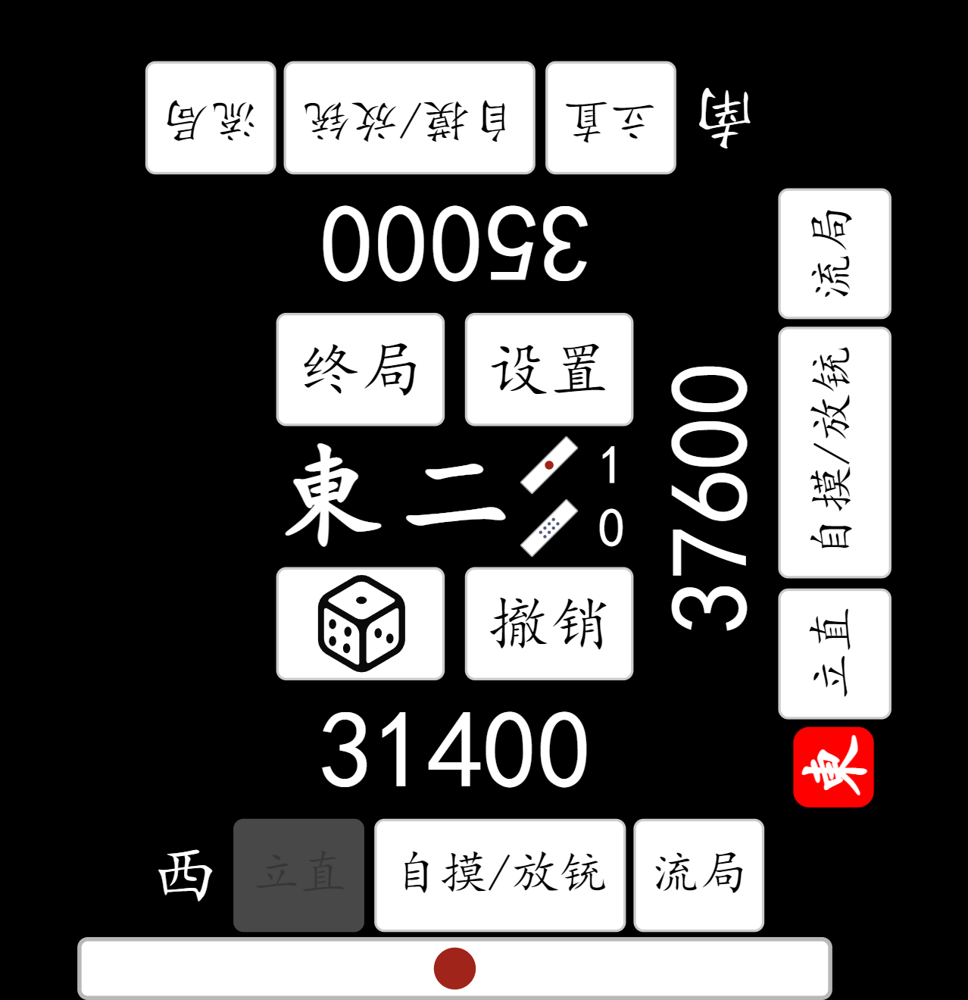
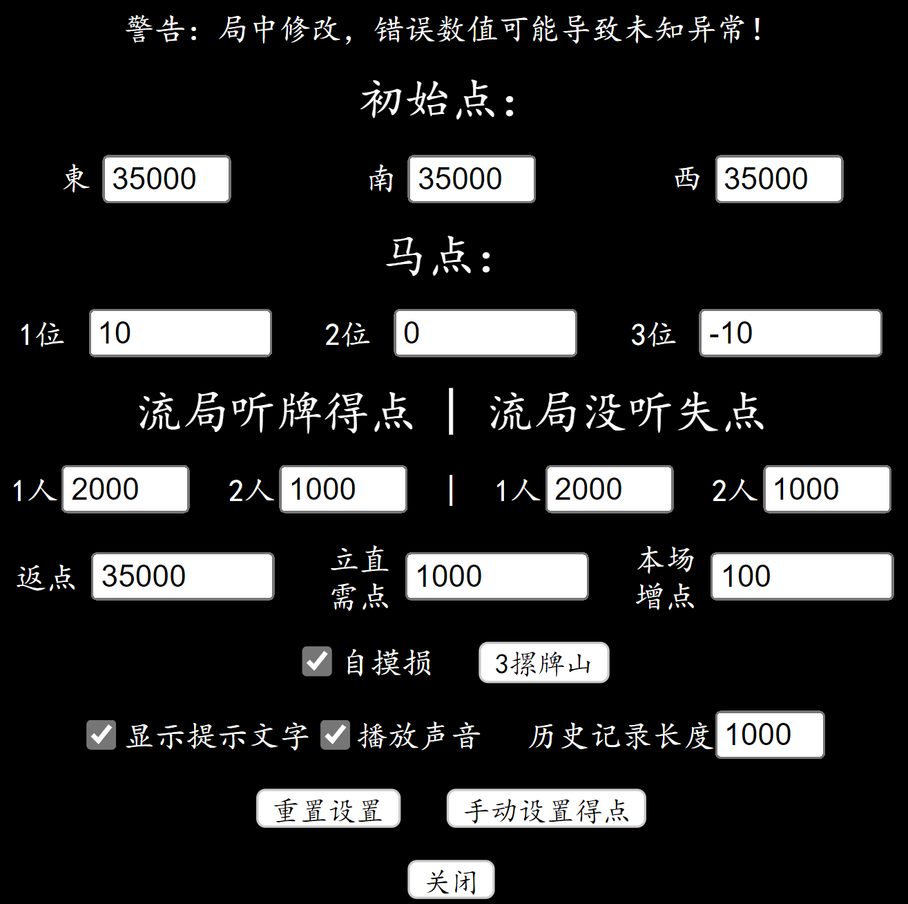

# MahjongHelperSanma

A simple sanma riichi mahjong helper page based on Vue.

网页版三麻工具，操作和四麻版本基本一样，可参考[MahjongHelper](../MahjongHelper/README.md)。
部分不同的设置见下。

不提供指定和牌形算番功能，可以使用[MahjongCalc](../MahjongCalc/README.md)。

### 和四麻版的区别介绍

#### 界面

以主界面为例，初始北风位的所有操作都被移除。

#### 设置界面

相比四麻，多了两项设置：自摸损和牌山摞数。

- 自摸损：默认启用，自摸时由于不存在北家得点会变低。如果不启用自摸损，使用平分法计算，
  应从北家获得的点数转由其余两家平均分摊，北家不支付本场棒。
  例：南家2本场跳满自摸，庄家6200+1500=7700点，闲家付3200+1500=4700点。
- 牌山摞数(点击切换3摞牌山/4摞牌山)：在骰子决定牌山开门时，牌山三摞和四摞开门位置有不同。如果是手搓三麻一般为三摞，
  但是使用麻将机时一般为四摞。默认四摞的情况，如果是三摞，且需要严格按照骰子点数决定开门，
  请调整为三摞。
